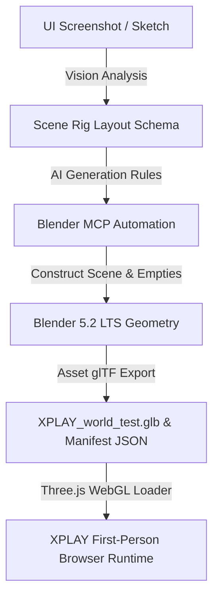

# Blender MCP World Lab

This is an isolated proof-of-concept lab verifying the **Blender MCP → Blender world geometry → GLB export → browser first-person runtime → persistent world coordinates** pipeline for the XPLAY Engine.

## Architecture Pipeline

The goal of this architecture is to connect visual layout parsing (screenshot) to stable game geometry and runtime navigation:



By ensuring that coordinates are treated consistently between Blender and the browser, we establish a robust placement loop:
1. **Coord mapping:** Blender coordinate space (meters, `Z = up`, `Y = forward`) is converted cleanly to Three.js coordinates (`X = X`, `Y = Z`, `Z = -Y`) on import.
2. **Landmark memory:** The browser reads `XPLAY_world_test_manifest.json` at startup to preserve spatial identity and run proximity calculations against the stable landmarks defined in Blender.

---

## File Locations

All lab assets are kept isolated inside the public directory structure:
* **HTML Entry Point:** `public/labs/blender-mcp-world-lab/index.html`
* **Three.js Logic:** `public/labs/blender-mcp-world-lab/app.js`
* **Styles & HUD:** `public/labs/blender-mcp-world-lab/style.css`
* **World Model (GLB):** `public/labs/blender-mcp-world-lab/assets/XPLAY_world_test.glb`
* **JSON Coordinate Manifest:** `public/labs/blender-mcp-world-lab/assets/XPLAY_world_test_manifest.json`

---

## Controls & Usage

To open the lab, ensure a local server is running and navigate to the lab directory:
1. Click inside the browser viewport to lock your cursor.
2. **Walk:** `W` `A` `S` `D`
3. **Sprint:** Hold `Shift`
4. **Look:** Mouse (Pointer Lock)
5. **Reset Player:** Relocate back to the canonical spawn coordinate (`0.0, -38.0, 1.7`) facing down the road.
6. **Toggle Collision Debug:** Display red axis-aligned bounding boxes around the physical buildings, tower, and bridge pillars.

---

## Setup & Connection

### 1. Blender MCP Connection
The Blender MCP server runs locally as a node command or executable bridging port `9876` of the Blender MCP Add-on:
- Configured in: `C:\Users\2flyk\.gemini\config\mcp_config.json`
- Executable: `C:\Users\2flyk\.local\bin\blender-mcp.exe`
- Stdio transport links the LLM directly to the Blender session.

### 2. Launching the Browser Lab
Run the project's express development server:
```bash
npm start
```
Then navigate to:
```text
http://localhost:3000/labs/blender-mcp-world-lab/index.html
```
*(or the default port active in your project)*

## Input fix (keyboard/pointer lock)
The viewer now listens for `KeyboardEvent.code` on `window`, allows WASD movement independently of pointer-lock state, focuses the canvas on click, and uses pointer lock only for mouse look. The HUD exposes live `Input` and `Pointer` status for validation.

## Important: do not open `index.html` directly

This lab uses ES modules plus `fetch()` for the GLB manifest and assets. Opening `index.html` by double-clicking it produces a `file:///...` URL and the browser will block required module/asset loading.

Use `START_LAB.bat` from this folder, or start the XPLAY server from the repo root and open:

`http://localhost:8788/labs/blender-mcp-world-lab/index.html`
